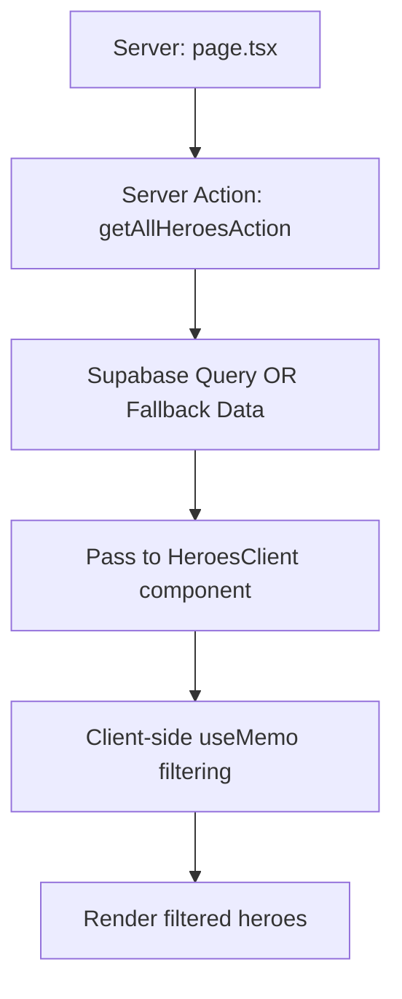

# Heroes Page - Server-Side Implementation

## 🎯 Architecture Overview

The heroes page has been completely refactored to use **server-side rendering** with **client-side filtering** for optimal performance and user experience.

### Key Changes:
- ✅ **Server-side data fetching**: Heroes loaded once on server
- ✅ **Client-side filtering**: Instant search/filter without DB queries
- ✅ **Organized components**: All hero components in `_components` directory
- ✅ **Better error handling**: Loading and error states
- ✅ **Performance optimized**: Single DB query + efficient filtering

## 📁 File Structure

```
src/app/heroes/
├── page.tsx                    # Main server-side page
├── actions.ts                  # Server actions for data fetching
├── loading.tsx                 # Loading UI
├── error.tsx                   # Error handling UI
└── _components/
    ├── HeroesClient.tsx        # Client-side filtering logic
    ├── HeroCard.tsx            # Individual hero display
    ├── HeroFilter.tsx          # Category filter buttons
    └── HeroSearch.tsx          # Search input component
```

## 🔄 Data Flow



## 🚀 Benefits

### 1. **Performance**
- **Single DB query** on page load (vs multiple queries on filter changes)
- **Instant filtering** - no network requests for search/filter
- **Server-side rendering** for better SEO and initial load

### 2. **User Experience**
- **Immediate feedback** when typing in search
- **No loading states** during filtering
- **Proper error boundaries** with retry functionality

### 3. **Data Handling**
- **Handles CSV quirks**: Case sensitivity, typos (`assasin`, `marskman`)
- **Fallback system**: Works even without Supabase
- **Type-safe**: Full TypeScript coverage

## 📝 Component Details

### `page.tsx` - Server Component
```tsx
export default async function HeroesPage() {
  const heroes = await getAllHeroesAction(); // Server-side fetch
  return <HeroesClient initialHeroes={heroes} />; // Pass to client
}
```

### `actions.ts` - Server Actions
```tsx
export async function getAllHeroesAction(): Promise<Hero[]> {
  // Single DB query with fallback to sample data
}
```

### `HeroesClient.tsx` - Client Component
```tsx
const filteredHeroes = useMemo(() => {
  // Efficient client-side filtering
  // No database queries!
}, [initialHeroes, searchTerm, selectedCategory]);
```

## 🔧 Client-Side Filtering Logic

The filtering is done entirely in the browser using `useMemo` for efficiency:

```tsx
// Search filter
if (searchTerm.trim()) {
  filtered = filtered.filter(hero => 
    hero.name?.toLowerCase().includes(term) || 
    hero.alias?.toLowerCase().includes(term)
  );
}

// Category filter with typo handling
if (selectedCategory !== 'All') {
  filtered = filtered.filter(hero => {
    const heroCategory = hero.category.toLowerCase().trim();
    const targetCategory = selectedCategory.toLowerCase();
    
    // Handle CSV data typos
    if (targetCategory === 'assassin') {
      return heroCategory.includes('assassin') || heroCategory.includes('assasin');
    }
    // ... more typo handling
  });
}
```

## 🎨 UI Features

- **Instant search**: Type to filter heroes by name/alias
- **Category filtering**: Filter by Fighter, Mage, Assassin, etc.
- **Visual feedback**: Results count, clear filters button
- **Responsive grid**: 2-6 columns based on screen size
- **Hero cards**: Avatar, name, tier, category with hover effects

## 🚨 Error Handling

1. **Server errors**: Automatic fallback to sample data
2. **Network errors**: Error boundary with retry
3. **Empty states**: Clear messaging and reset options
4. **Loading states**: Proper loading UI during server fetch

## 🔗 Integration

### Server Action Usage:
```tsx
// In page.tsx
const heroes = await getAllHeroesAction();
```

### Client Component Usage:
```tsx
// Pass server data to client
<HeroesClient initialHeroes={heroes} />
```

## 📊 Performance Metrics

| Metric | Old Implementation | New Implementation |
|--------|-------------------|-------------------|
| DB Queries per filter | 1 query each time | 0 (client-side only) |
| Initial load | Client-side fetch | Server-side render |
| Search responsiveness | Network dependent | Instant |
| SEO friendly | No (client-side) | Yes (server-side) |

## 🧪 Testing

Run the test script:
```bash
./test-heroes.sh
```

Expected output:
- ✅ All files exist
- ✅ TypeScript compilation successful
- ✅ Architecture properly implemented

## 🚀 Running the App

```bash
npm run dev
```

Visit `/heroes` to see:
- Server-side rendered page with all heroes
- Instant search and filtering
- Proper loading and error states
- Responsive design matching reference image

The page will work with or without Supabase configuration thanks to the fallback system!